#  [dcservo-1](https://github.com/Motion-Controller/dcservo-1)  

## SLIDECK

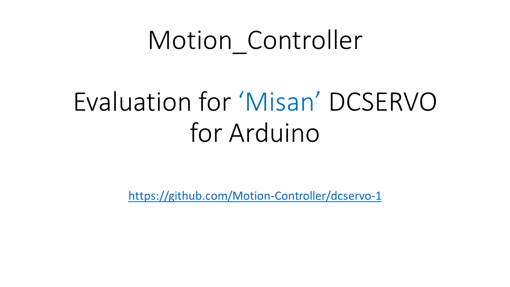

 

----

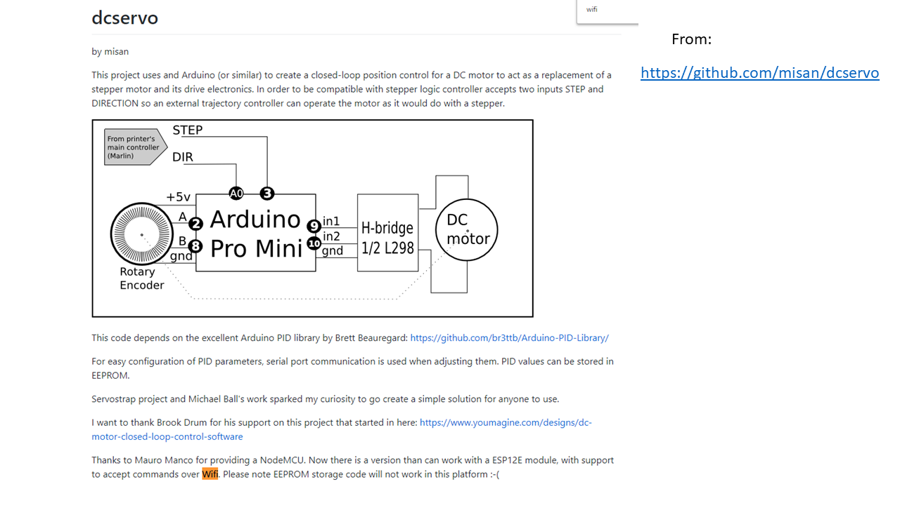

 

----

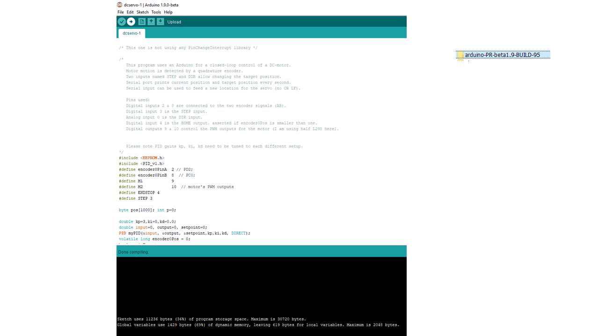

 

----

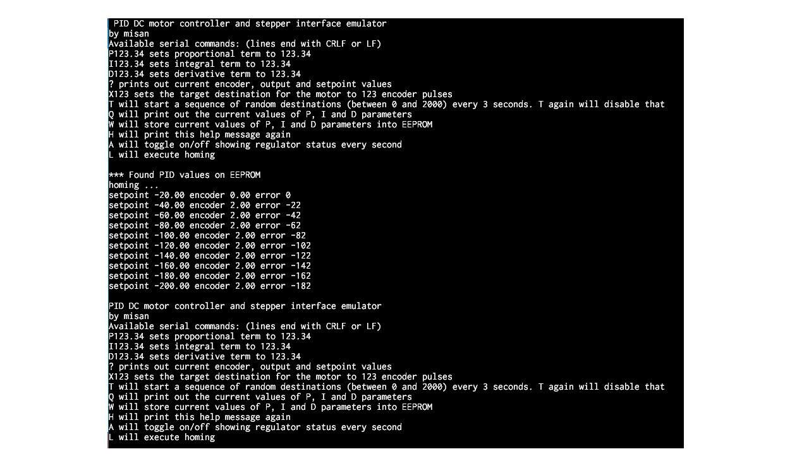

 

----

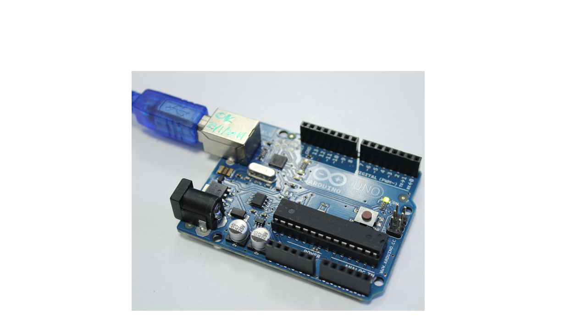

 

----

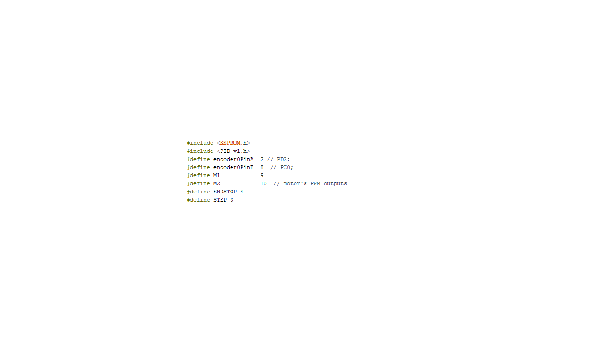

 

----

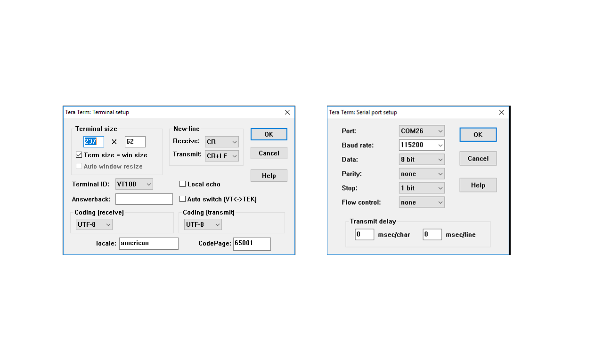

 

----

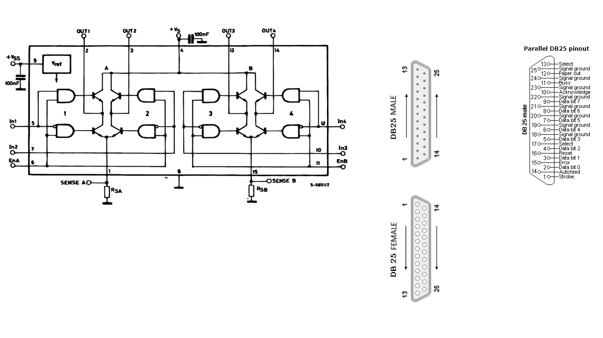

 

----

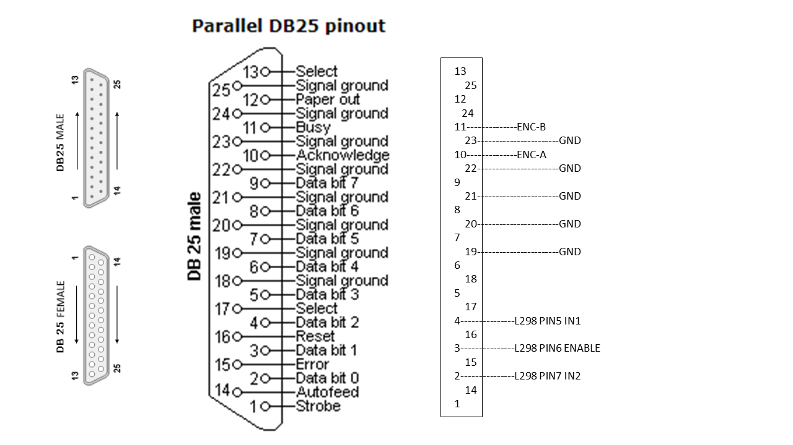

 

----

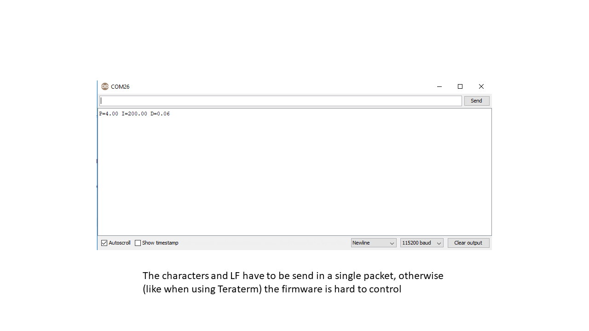

 

----

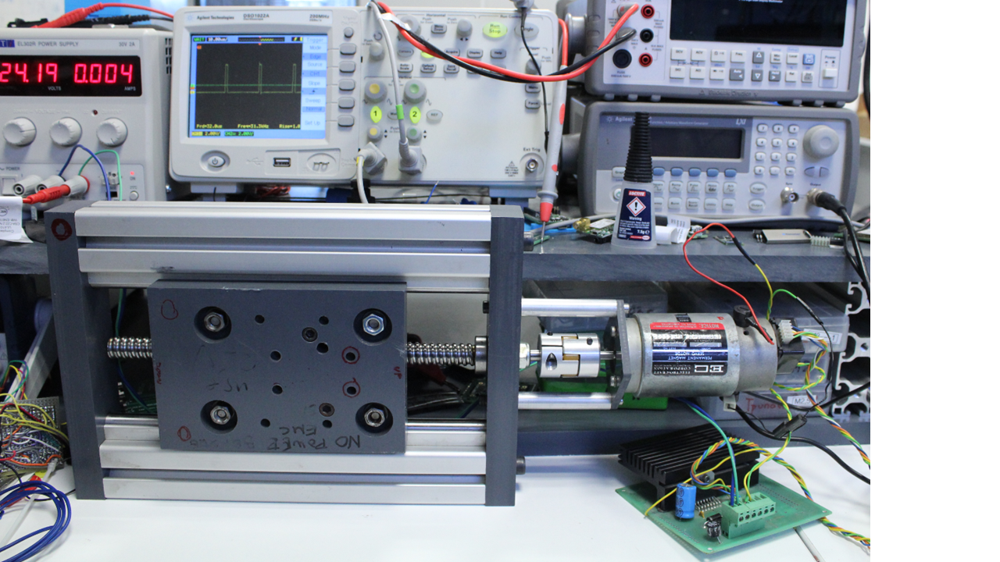

 

----

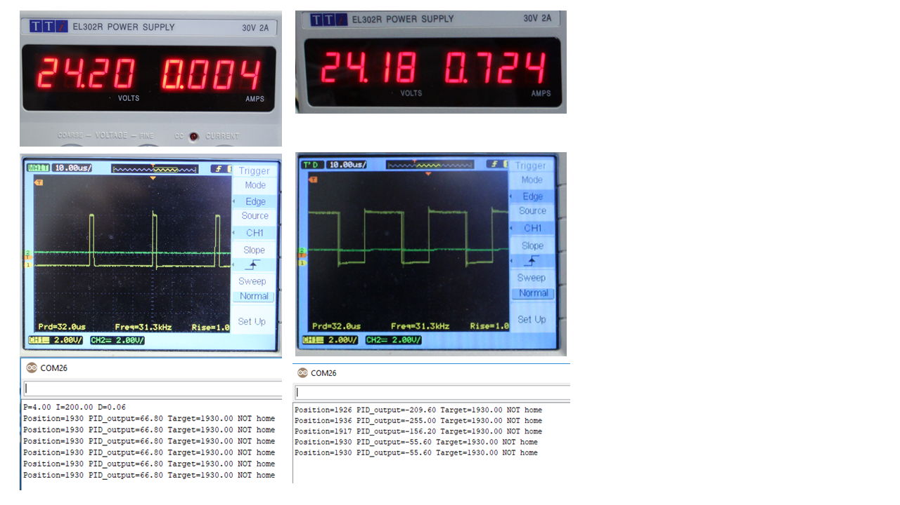

 

----

